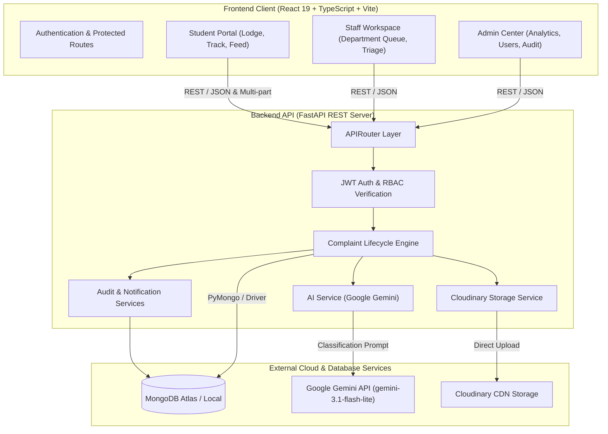

# ⚡ ResolveX

<div align="center">


**Unified AI-Powered Complaint Management & Resolution Platform**  
*Full-stack integration featuring FastAPI, Google Gemini AI, MongoDB, Cloudinary, and React 19 + TypeScript.*

[](https://fastapi.tiangolo.com/)
[](https://python.org)
[](https://react.dev/)
[](https://www.typescriptlang.org/)
[](https://vitejs.dev/)
[](https://www.mongodb.com/)
[](https://ai.google.dev/)
[](https://cloudinary.com/)
[](#-license)

[Features](#-key-features) • [Architecture](#-system-architecture) • [Tech Stack](#-tech-stack) • [Quick Start](#-quick-start-backend--frontend) • [Scripts](#-frontend-scripts) • [API Reference](#-api-endpoints) • [Configuration](#-environment-variables)

</div>

---

## 📌 Overview

**ResolveX** is an end-to-end, enterprise-grade grievance redressal platform engineered for academic institutions, universities, and organizations. Traditional complaint management systems suffer from manual triage bottlenecks, unorganized departmental queues, lost attachments, and lack of status visibility.

ResolveX solves this through a unified modern architecture:
- **Intelligent Triage**: **Google Gemini AI** automatically categorizes grievances, assesses urgency, and routes issues to the right operational department.
- **Granular RBAC**: Distinct tailored workflows for **Students**, **Staff**, and **Administrators**.
- **Modern Responsive UI**: Built with **React 19**, **TypeScript**, and **Vite** with interactive **Recharts** visualizations.
- **Secure Media Storage**: **Cloudinary** integration with binary magic-byte verification for photographic evidence.
- **Traceability**: Real-time event notifications and an immutable **Audit Trail** tracking every status transition and action.

---

## ✨ Key Features

### 🤖 1. AI-Driven Intelligent Triage (Google Gemini)
- **Automatic Classification**: Categorizes incoming complaints into:  
  `ACADEMIC`, `HOSTEL`, `TRANSPORT`, `NETWORK`, `ELECTRICAL`, `CLEANLINESS`, `SECURITY`, `FACILITIES`, `TECHNICAL`, or `OTHER`.
- **Urgency Scoring**: Dynamically calculates severity: `LOW`, `MEDIUM`, `HIGH`, or `CRITICAL`.
- **Automated Routing**: Routes to the corresponding department:  
  `ACADEMICS`, `HOSTEL`, `TRANSPORT`, `IT`, `ELECTRICAL`, `MAINTENANCE`, `SECURITY`, or `ADMINISTRATION`.
- **Explainable Reasoning**: Produces an executive summary and justification for every classification decision.

### 👥 2. Role-Based Portals (RBAC)
- **🎓 Student Portal**:
  - Lodge complaints with title, description, location, and multiple photographic attachments.
  - Live timeline tracking (`PENDING` ➔ `IN_PROGRESS` ➔ `RESOLVED` / `REJECTED`).
  - Human-friendly complaint identifiers (e.g., `CMP-0042`).
  - Two-way response dialogue between students and handling personnel.
  - Personal notification stream on updates.
- **🛠️ Staff Workspace**:
  - Filtered queue displaying complaints assigned to the staff member's department.
  - Triage management: claim issues, update status progression, and submit resolution commentary.
  - Real-time alerts when new complaints land in their department.
- **🛡️ Admin Command Center**:
  - System-wide visibility across all departments, categories, and severity queues.
  - User Directory: Provision, edit, activate, or deactivate accounts across all roles.
  - Reassignment override for departments and personnel.
  - Full system **Audit Logs** documenting all actions with timestamps and actor details.
  - High-level **Analytics Dashboard** for resolution velocity and backlogs.

### 📊 3. Interactive Analytics & Reporting
- Powered by **Recharts**:
  - **Status distribution**: Pending vs. In Progress vs. Resolved vs. Rejected.
  - **Department workload breakdown**.
  - **Category and priority severity matrices**.
  - Executive KPI summary cards.

### 📷 4. Secure Media Storage
- Cloud-hosted photo evidence via **Cloudinary**.
- Binary magic-byte inspection (supports JPEG, PNG, WebP) to prevent MIME spoofing.
- File size validation (default max 5 MB).

### 📜 5. Notifications & Audit Trail
- Push-style notification feeds for status changes, new assignments, and responses.
- Complete audit trail logging actor ID, action type, target entity, metadata diffs, and ISO timestamps.

---

## 🏗️ System Architecture



---

## 💻 Tech Stack

### Backend
| Technology | Version / Tool | Purpose |
| :--- | :--- | :--- |
| **FastAPI** | `0.141.1` | Modern async REST API framework |
| **Python** | `3.11+` | Core programming language |
| **MongoDB / PyMongo** | `4.17.0` | Flexible document database for complaints, users & logs |
| **Google GenAI** | `2.17.0` (`gemini-3.1-flash-lite`) | AI complaint classification & priority evaluation |
| **Cloudinary** | `1.46.2` | Image hosting & CDN delivery |
| **PyJWT & Argon2** | `2.13.0` / `25.1.0` | Stateless token authentication & password hashing |
| **Pydantic v2** | `2.13.4` | Data validation, schemas & type settings |
| **Uvicorn** | `0.52.1` | ASGI web server implementation |

### Frontend
| Technology | Version / Tool | Purpose |
| :--- | :--- | :--- |
| **React** | `19.2.8` | Declarative component UI library |
| **TypeScript** | `6.0 / 5.x` | Static typing & developer ergonomics |
| **Vite** | `8.2 / 6.x` | Next-generation frontend bundler & dev server |
| **React Router** | `7.18.2` | Client-side routing with role-based route guards |
| **Recharts** | `3.10.1` | Interactive SVG-based data visualization charts |
| **Axios** | `1.19.0` | Promise-based HTTP client with request interceptors |
| **Vanilla CSS** | Modern tokens | High-performance styling with theme variables & dark mode |

---

## 📁 Unified Repository Structure

```text
ResolveX/
├── Backend/                        # FastAPI Backend Application
│   ├── app/
│   │   ├── core/                   # Security (JWT, Argon2) & BaseSettings
│   │   │   ├── config.py
│   │   │   └── security.py
│   │   ├── database/               # MongoDB driver connection & ping check
│   │   │   └── mongodb.py
│   │   ├── models/                 # Database schema models & enums
│   │   │   └── user.py
│   │   ├── routes/                 # REST API router modules
│   │   │   ├── analytics.py        # Analytics & metrics endpoints
│   │   │   ├── audit.py            # Audit log inspection endpoints
│   │   │   ├── auth.py             # Login, registration, /me
│   │   │   ├── complaints.py       # Complaint submission, status & assign
│   │   │   ├── notifications.py    # Notification feeds & read markers
│   │   │   ├── responses.py        # Threaded discussion & comments
│   │   │   └── users.py            # Admin user management
│   │   ├── schemas/                # Pydantic validation schemas
│   │   │   ├── ai.py
│   │   │   ├── auth.py
│   │   │   ├── complaint.py
│   │   │   ├── notification.py
│   │   │   ├── response.py
│   │   │   └── user.py
│   │   ├── services/               # Business logic & external integrations
│   │   │   ├── ai_service.py       # Gemini API client & classification logic
│   │   │   ├── analytics_service.py# Aggregation pipelines
│   │   │   ├── audit_service.py    # Structured audit logging
│   │   │   ├── auth_service.py     # Authentication logic
│   │   │   ├── complaint_service.py# Core complaint workflow & counters
│   │   │   ├── notification_service.py
│   │   │   ├── response_service.py
│   │   │   ├── routing_service.py
│   │   │   ├── storage_service.py  # Cloudinary file upload & byte validation
│   │   │   └── user_service.py
│   │   └── main.py                 # Application root, CORS setup, health check
│   ├── scripts/                    # Maintenance & data migration utilities
│   │   └── migrate_complaint_numbers.py
│   ├── tests/                      # Automated test suite (Pytest + TestClient)
│   │   └── test_features.py
│   ├── .env.example                # Backend environment template
│   └── requirements.txt            # Python dependencies
│
├── Frontend/                       # React 19 + TypeScript Frontend
│   ├── public/                     # Static public assets
│   ├── src/
│   │   ├── assets/                 # SVGs, icons, and illustrations
│   │   ├── components/             # Reusable UI component library
│   │   │   ├── common/             # Buttons, badges, modal dialogs, inputs
│   │   │   ├── complaints/         # Cards, file uploaders, history timelines
│   │   │   ├── dashboard/          # Metrics cards and KPI widgets
│   │   │   ├── layout/             # Top navbar, responsive sidebar
│   │   │   └── notifications/      # Notification popover and list items
│   │   ├── context/                # AuthContext (token storage, active user)
│   │   ├── data/                   # Constants and mock categories
│   │   ├── pages/                  # Page-level route views
│   │   │   ├── admin/              # AdminDashboard, Users, Audit, Analytics
│   │   │   ├── staff/              # StaffDashboard, Department Queue
│   │   │   ├── student/            # StudentDashboard, SubmitComplaint
│   │   │   ├── Login.tsx           # Authentication view
│   │   │   └── Unauthorized.tsx    # 403 Forbidden screen
│   │   ├── routes/                 # ProtectedRoute wrapper with RBAC
│   │   ├── services/               # Axios API client modules
│   │   ├── styles/                 # Modular CSS stylesheets
│   │   ├── types/                  # Shared TypeScript interfaces & types
│   │   ├── App.tsx                 # Client router configuration
│   │   ├── main.tsx                # React DOM render entry
│   │   └── index.css               # Design system, CSS variables & utilities
│   ├── index.html                  # HTML5 template
│   ├── package.json                # Frontend dependencies & npm scripts
│   ├── tsconfig.json               # TypeScript compiler options
│   └── vite.config.ts              # Vite build configuration
│
└── README.md                       # Complete Project Documentation
```

---

## 🚀 Quick Start (Backend + Frontend)

### Prerequisites
- **Python 3.11+** installed
- **Node.js 18+** and **npm** installed
- A **MongoDB** database (Local instance or [MongoDB Atlas](https://www.mongodb.com/atlas))
- A **Google Gemini API Key** ([Google AI Studio](https://aistudio.google.com/))
- *(Optional)* A **Cloudinary** account for image hosting ([Cloudinary](https://cloudinary.com/))

---

### Step 1: Set Up and Run the Backend

```bash
# 1. Navigate to Backend directory
cd Backend

# 2. Create and activate a Python virtual environment
# On Windows:
python -m venv venv
.\venv\Scripts\activate

# On macOS/Linux:
python3 -m venv venv
source venv/bin/activate

# 3. Install dependencies
pip install -r requirements.txt

# 4. Create your .env configuration file
cp .env.example .env
```

Open `Backend/.env` and supply your environment values:
```env
MONGODB_URI=mongodb+srv://<username>:<password>@<cluster-url>/
DATABASE_NAME=resolvex

JWT_SECRET_KEY="your-super-secret-jwt-key"
GEMINI_API_KEY="your-gemini-api-key"

ENVIRONMENT=development

# Cloudinary (Required for image attachments)
CLOUDINARY_CLOUD_NAME="your_cloud_name"
CLOUDINARY_API_KEY="your_api_key"
CLOUDINARY_API_SECRET="your_api_secret"
```

Start the backend API server:
```bash
uvicorn app.main:app --reload --host 127.0.0.1 --port 8000
```
- **Backend API**: `http://127.0.0.1:8000`
- **Swagger Interactive API Docs**: [http://127.0.0.1:8000/docs](http://127.0.0.1:8000/docs)
- **ReDoc Interactive Docs**: [http://127.0.0.1:8000/redoc](http://127.0.0.1:8000/redoc)
- **Health Check**: [http://127.0.0.1:8000/api/health](http://127.0.0.1:8000/api/health)

---

### Step 2: Set Up and Run the Frontend

Open a **new terminal window**:

```bash
# 1. Navigate to Frontend directory
cd Frontend

# 2. Install dependencies
npm install

# 3. Create frontend .env pointing to the backend
# On Windows (PowerShell):
echo "VITE_API_BASE_URL=http://127.0.0.1:8000/api" > .env

# On macOS/Linux:
echo "VITE_API_BASE_URL=http://127.0.0.1:8000/api" > .env

# 4. Start the Vite development server
npm run dev
```

Visit **[http://localhost:5173](http://localhost:5173)** in your browser.

---

## 📜 Frontend Scripts

Inside the `Frontend/` directory, you can run:

| Command | Action |
| :--- | :--- |
| `npm run dev` | Launches local development server with instant Hot Module Replacement (HMR) at `localhost:5173` |
| `npm run build` | Runs TypeScript compiler checks (`tsc -b`) and produces optimized production build in `dist/` |
| `npm run lint` | Runs ESLint across all TypeScript and React source files |
| `npm run preview` | Starts a local server to preview the compiled production build from `dist/` |

---

## ⚙️ Environment Variables

### Backend Configuration (`Backend/.env`)

| Variable | Type | Required | Description | Default |
| :--- | :---: | :---: | :--- | :--- |
| `MONGODB_URI` | String | **Yes** | MongoDB connection string (Atlas or `mongodb://localhost:27017`) | - |
| `DATABASE_NAME` | String | **Yes** | Target database name | `resolvex` |
| `JWT_SECRET_KEY` | String | **Yes** | Secret cryptographic key used to sign JWT access tokens | - |
| `JWT_ALGORITHM` | String | No | Cryptographic signing algorithm | `HS256` |
| `ACCESS_TOKEN_EXPIRE_MINUTES` | Integer | No | Validity duration of issued access tokens (minutes) | `60` |
| `GEMINI_API_KEY` | String | **Yes** | Google Gemini API key for automated complaint triage | - |
| `ENVIRONMENT` | String | No | Application environment mode (`development` / `production`) | `development` |
| `CLOUDINARY_CLOUD_NAME` | String | Optional | Cloudinary account cloud name for image uploads | `None` |
| `CLOUDINARY_API_KEY` | String | Optional | Cloudinary API Key | `None` |
| `CLOUDINARY_API_SECRET` | String | Optional | Cloudinary API Secret | `None` |
| `MAX_UPLOAD_SIZE_BYTES` | Integer | No | Maximum allowed image attachment file size | `5242880` (5 MB) |

### Frontend Configuration (`Frontend/.env`)

| Variable | Type | Required | Description | Default |
| :--- | :---: | :---: | :--- | :--- |
| `VITE_API_BASE_URL` | String | **Yes** | Fully-qualified URL to backend `/api` endpoint | `http://127.0.0.1:8000/api` |

---

## 📡 API Endpoints

All backend endpoints are scoped under `/api`.

### 🔐 Authentication (`/api/auth`)
| Method | Endpoint | Access | Description |
| :--- | :--- | :---: | :--- |
| `POST` | `/api/auth/register` | Public | Register a new user account (Student default) |
| `POST` | `/api/auth/login` | Public | Authenticate user credentials and return JWT bearer token |
| `GET` | `/api/auth/me` | Authenticated | Return the current user's profile and active role |

### 📋 Complaints (`/api/complaints`)
| Method | Endpoint | Access | Description |
| :--- | :--- | :---: | :--- |
| `POST` | `/api/complaints/` | Student | Submit a complaint (triggers Gemini AI classification) |
| `GET` | `/api/complaints/` | Authenticated | Retrieve complaints filtered by role, status, or department |
| `GET` | `/api/complaints/{id}` | Authenticated | Retrieve full complaint details, AI reasoning, and image URLs |
| `PATCH`| `/api/complaints/{id}/status` | Staff / Admin | Advance or change complaint status (`IN_PROGRESS`, `RESOLVED`, `REJECTED`) |
| `PATCH`| `/api/complaints/{id}/assign` | Admin | Manually assign complaint to a staff member or department |

### 💬 Threaded Responses (`/api/responses`)
| Method | Endpoint | Access | Description |
| :--- | :--- | :---: | :--- |
| `POST` | `/api/responses/{complaint_id}` | Authenticated | Add an official response or student comment to a complaint |
| `GET` | `/api/responses/{complaint_id}` | Authenticated | Retrieve complete threaded response history for a complaint |

### 👥 User Administration (`/api/users`)
| Method | Endpoint | Access | Description |
| :--- | :--- | :---: | :--- |
| `GET` | `/api/users/` | Admin | List all registered users across the platform |
| `POST` | `/api/users/` | Admin | Provision a new Staff or Admin user account |
| `PATCH`| `/api/users/{id}/status` | Admin | Toggle user active / deactivated state |

### 📊 Analytics & Reporting (`/api/analytics`)
| Method | Endpoint | Access | Description |
| :--- | :--- | :---: | :--- |
| `GET` | `/api/analytics/overview` | Admin | Aggregated metrics for status, department, and category counts |
| `GET` | `/api/analytics/trends` | Admin | Historical metrics and resolution velocity |

### 📜 Audit Logs & Notifications
| Method | Endpoint | Access | Description |
| :--- | :--- | :---: | :--- |
| `GET` | `/api/audit/` | Admin | View system audit trail with actor details and filters |
| `GET` | `/api/notifications/` | Authenticated | Retrieve notification alerts for current user |
| `PATCH`| `/api/notifications/{id}/read` | Authenticated | Mark a notification as read |

### 🩺 System Health (`/api/health`)
| Method | Endpoint | Access | Description |
| :--- | :--- | :---: | :--- |
| `GET` | `/api/health` | Public | Return API status and MongoDB database connectivity |

---

## 🧪 Testing & Validation

### Backend Testing (Pytest)
The backend includes test coverage for health checks, input validation, image MIME verification, and role permissions:

```bash
cd Backend
pytest tests/ -v
```

### Frontend Validation (Linting & TypeScript Build)
Ensure code cleanliness and strict type safety:

```bash
cd Frontend
# Check for lint issues
npm run lint

# Perform TypeScript compile check
npm run build
```

---

## 🛠️ Database Utilities & Migrations

If migrating existing complaint records without sequential tracking identifiers:

```bash
cd Backend
python -m scripts.migrate_complaint_numbers
```
This utility assigns human-readable numbers (e.g., `CMP-0001`) to existing records and initializes the atomic MongoDB counter sequence.

---

## 🛡️ Security Best Practices

- **Argon2id Hashing**: Industry-standard cryptographic password hashing with unique salt.
- **Stateless JWT Authorization**: Bearer tokens with strict expiration and RBAC claims.
- **Magic-Byte Image Inspection**: File headers are inspected directly to prevent malicious file uploads.
- **CORS Allowlist**: Explicitly restricts origin domains for local development and production deployments.
- **Immutable Audit Logging**: Actions are logged with actor details and timestamps to preserve accountability.

---

## 📄 License

Distributed under the **MIT License**. See `LICENSE` for more information.

<div align="center">
  <sub>Designed & Developed for <strong>ResolveX</strong></sub>
</div>
